# K-Medoids implementation in CUDA

##### Highlights
- Our Parallel and sequential code beats scikit-learn and pyclustering on reasonably large collections.
- Our parallel code, using shared memory leads to 10x-15x speedup.

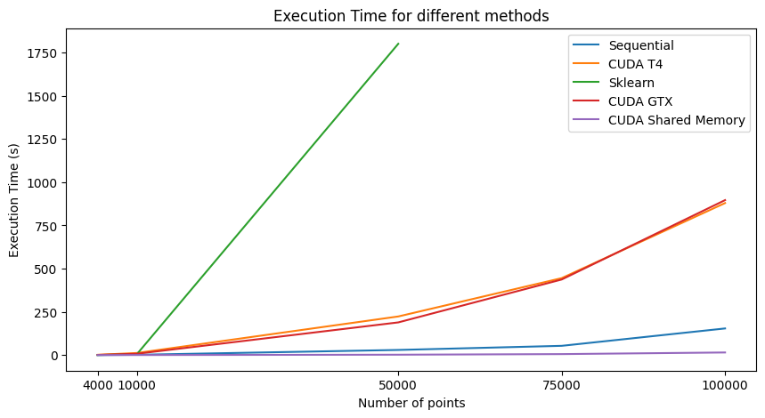

##### Time taken
| Number of points | K | Sequential (s) | CUDA T4 (s) | Scikit-learn (s) | CUDA GTX 1650(s) | CUDA Shared memory| Plots |
|------------------|---|----------------|-------------|------------------|------------------|-------------------|-------|
| 4000             | 4 |      0.152     |   1.583     |   0.47           |      1.22        |        0.24       |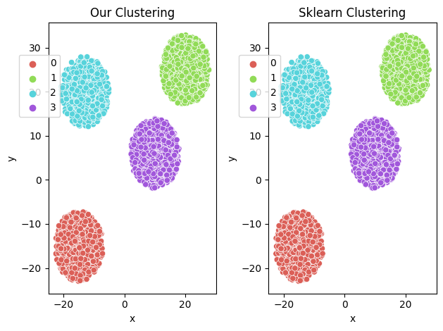 |
| 10000            | 5 |      1.77      |   12.11     |   5              |      7.7         |        0.42       |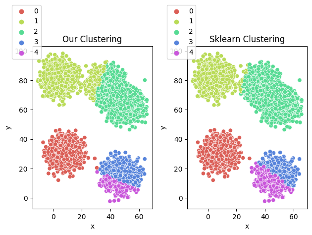 |
| 50000            | 10|      29.76     |   223.3     |  ~30 mins        |      189         |        2.26       |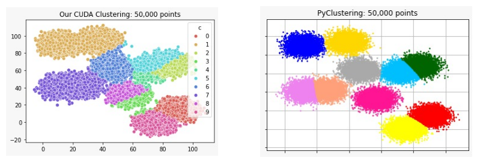 |       |
| 75000            | 10|      53.5      |   445       |    ~             |      437         |        5.7        |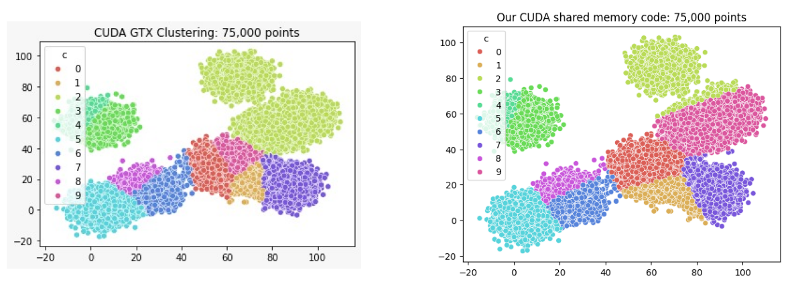       |
| 100000           | 10|      154       |    879.9    |    ~             |      896         |        15.1       |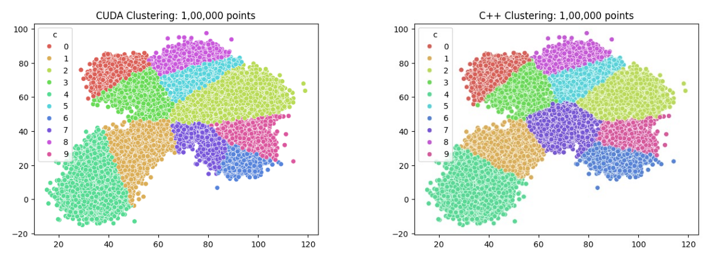 |

For 1,00,000 points, we got some interesting results, our sequential code works way faster than any other. Below are the time taken and clusters produced for different packages and settings on 1,00,000 points dataset:
| Sequential (s) | CUDA T4 (s) | Scikit-learn (s) | CUDA GTX 1650(s) | CUDA shared memory(s)| CUDA co-operative groups |
|----------------|-------------|------------------|------------------|----------------------|--------------------------|
| 154            | 879.9       |         ~        |      896         |       15.1           |          0.25            |
| 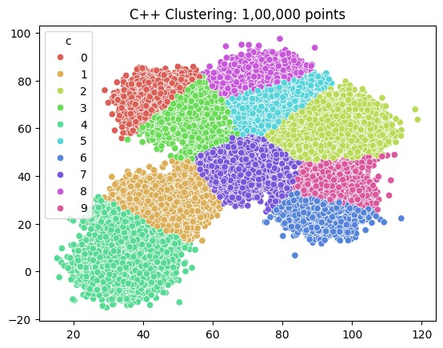 | 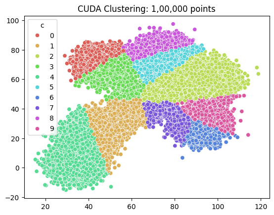 | ~ | 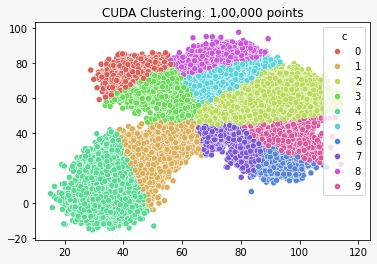  | 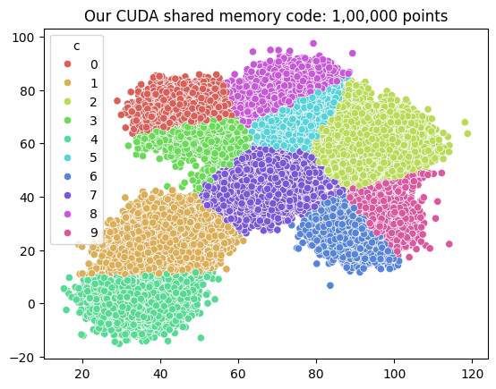 | 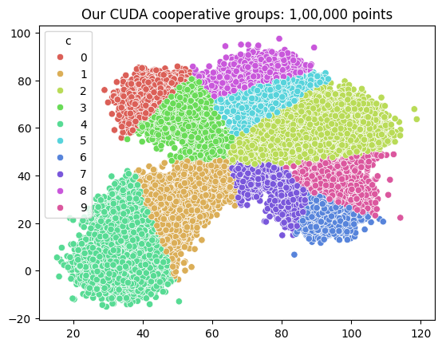 |

Note: More than 50,000 points did not load in our laptops because scikit-learn implementation requires  ~18 GB RAM. As a thrird-party comparison alternative, we chose [`pyclustering`](https://pyclustering.github.io/docs/0.8.2/html/index.html) which utilizes minimal RAM.

##### Observations
Using shared memory in `_dissimilarities` and `kMedoidsClusterAssignmentKernel`, we could significantly reduce the time while bearing minimal distortions to the clusters.

| Number of points | K | No shared memory | Shared memory |
|------------------|---|------------------|---------------|
| 1,00,000         | 10|        879s       |      15.1s     |
| 50,000           | 10|        223.3 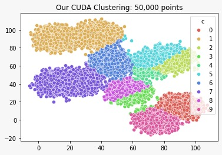   |   2.26s  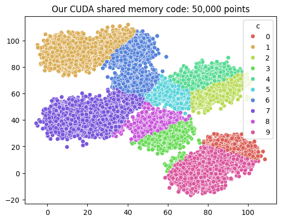   |
| 75,000           | 10|        445s  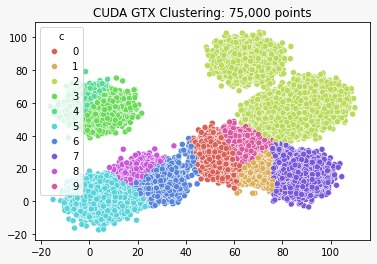   |   5.7s   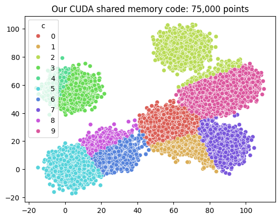   |

We also experimented with co-operative groups and found out that for datasets with number of points less than the total number of threads on the GPU device, K-Medoids could be solved in `O(1)` time complexity(this hypothesis was experimentally proven because average time for datasets ranging from 1000 to 100000 points was `0.267 seconds`)


##### Time comparison with fixed K
| Number of points | K | CUDA shared memory(s)|
|------------------|---|----------------------|
| 10000            | 5 | 0.42                 |
| 10000            | 10| 0.43                 |
| 10000            | 15| 0.41                 |

We do not see much difference in time because we are parallelizing the operations dependent on `K` completely, so the time constraints are effectively only due to `N`.

#### Steps to run code:
1. Generating synthetic data
    - We provide a python code in `points_generator.py` to generate synthetic data. The code generates a csv file with the generated data. It can be modified to generate data of different dimensions and sizes as required.
    - Run `python points_generator.py --file_name "4_clus_30_points.txt" --points 30 --k 4` to generate a file with 30 points and 4 clusters. The file will be saved as `4_clus_30_points.txt`.

2. K-Medoids using sequential C++ code
    - Run `g++ -o compiled_seq_kmedoids kmedoids_sequential.cpp` to compile the code.
    - Run `./compiled_seq_kmedoids` to run the code. 
    - `<input_file>` is the text file generated by the `points_generator.py` code.
    - `<OUTPUT_DIR>` is the directory where the output files will be saved. These files include the final cluster assignments and the medoids in `clusters.csv`, `centroids.csv` and `datapoints.csv`.
    - To access the results in python, run the following code.
        ```python
        from utility import get_our_clustering
        df1, centroids1 = get_our_clustering("15_points") # Here "15_points" is the dir name
        ```
    - `df1` will contain the points and their corressponding cluster id. So columns will be `x`, `y`, `c`.

3. K-Medoids using our CUDA implementation
    - Run `nvcc -o compiled_cuda_kmedoids kmedoids_cuda.cu` to compile the code.
    - Run `./compiled_cuda_kmedoids` to run the code. Currently we have to hardcode the variables in the code itself and compile again.

4. K-Medoids using scikit-learn-extra
    - Use `get_sklearn_clustering` from `utility.py` to get the cluster assignments and medoids using scikit-learn-extra.
    - Run the code below
        ```python
        from utility import get_sklearn_clustering
        df2, centroids2 = get_sklearn_clustering("15_points.txt", 4)
        ```

5. Visualizing the results
    - We provide a function `compare_cluster_plots` in `utility.py` to compare two clustering results. It plots the clusters of the two clustering results side by side.
    - Run the code below to visualize the results.
        ```python
        from utility import compare_cluster_plots
        compare_cluster_plots(df1, df2, ["Scikit-learn", "Our implementation"])
        ```
    <!-- - Below are the results of the above toy examples:
        | 15_points.txt - Total 15 points| 5_points.txt - 5 points per cluster |
        |---------------|--------------|
        ||| -->